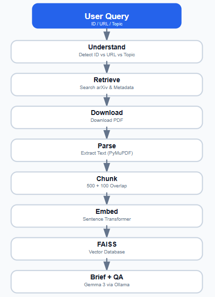
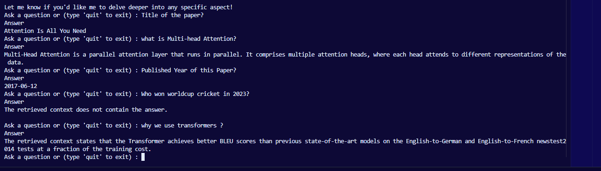

# arXiv Research Assistant using LangGraph + RAG

## Project Overview

This project is an AI-powered research assistant that can understand arXiv papers using Retrieval-Augmented Generation (RAG).

The user can provide:

* arXiv ID (e.g. `1706.03762`)
* arXiv URL
* Topic (e.g. `Recent RAG papers`)

The agent retrieves the paper, downloads the PDF, extracts the text, creates semantic embeddings, stores them in FAISS, generates an Executive Briefing, and answers questions using the paper's content.

## Architecture


## State Shape

| Field | Purpose |
|--------|---------|
| `query` | User input (arXiv ID, URL or Topic) |
| `is_topic_search` | Detects whether input is a topic or paper ID |
| `paper` | Stores paper metadata (title, authors, abstract) |
| `pdf_path` | Path of the downloaded PDF |
| `full_text` | Extracted text from the PDF |
| `chunks` | Text chunks created for RAG retrieval |
| `vectorstore` | FAISS vector database containing embeddings |
| `brief` | Generated Executive Briefing |
| `messages` | Conversation history for Question Answering |
## Tech Stack

* LangGraph
* Python
* Sentence Transformers
* FAISS
* PyMuPDF
* arXiv API
* Ollama (Gemma 3 1B)

## Setup

### Clone

```bash
git clone <your-repository-url>
cd arxiv-agent
```

### Create virtual environment

```bash
python -m venv .venv
```

### Activate

Windows:

```bash
.venv\Scripts\activate
```

### Install dependencies

```bash
pip install -r requirements.txt
```

### Install Ollama model

```bash
ollama pull gemma3:1b
```

### Run

```bash
python app.py
```

## Example Run

### Executive Briefing Output


### Sample QA



## Design Decisions & Tradeoffs

### Why LangGraph?

Instead of writing one long script, I separated the workflow into independent nodes. Every node has one responsibility and shares the same AgentState, making the pipeline easier to maintain and extend.

### Why Sentence Transformers + FAISS?

Sentence Transformers generate semantic embeddings, while FAISS performs fast similarity search over the paper chunks. This allows the system to retrieve only the most relevant context before sending it to the LLM.

### Why Ollama?

I replaced cloud APIs with Ollama to avoid rate limits and keep the project fully runnable locally using free tools.

### Known Limitations

* Figure and table extraction from PDFs can introduce noisy text.
* Retrieval quality depends on chunking and embedding quality.
* Small local LLMs may produce shorter or less detailed answers than larger cloud models.

### Future Improvements

* Hybrid search (BM25 + Vector Search)
* Better PDF layout extraction
* Citation-aware answers
* Multi-paper comparison
